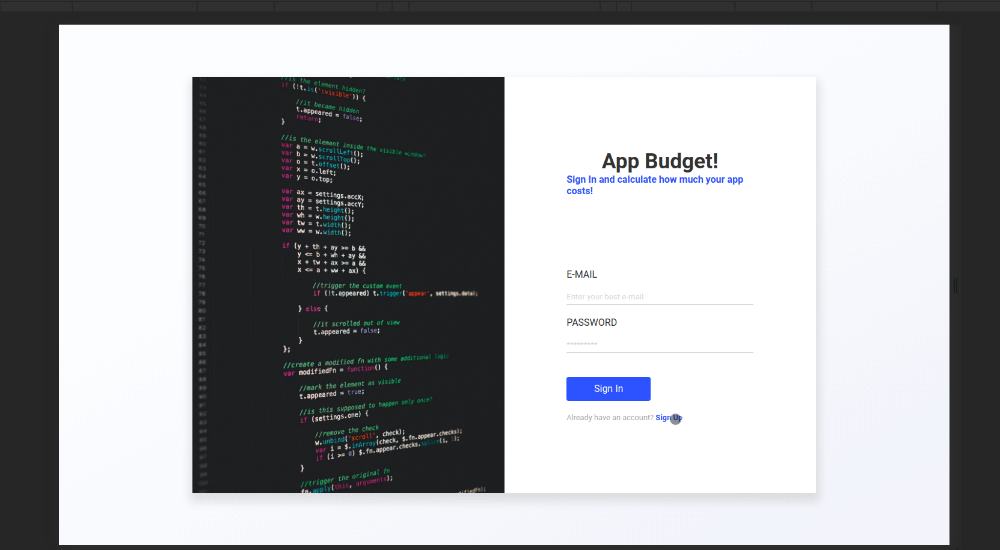

# app-budget-web

A ReactJS application for technology project costs. To use the service, the customer must have an account registered in the system. Within the system, it will provide the necessary data to request a quote. At the end, the system will display the total value of the project. The client can also consult old budgets.



## How to install

💭🔥 Don't forget to install the backend before running the project

<a href="https://github.com/vmnog/app-budget-backend">Install the backend</a>

**Clone the repository**

```
$ git clone  https://github.com/vmnog/app-budget-web.git

$ cd app-budget-web

$ yarn install

$ yarn start
```

### Features

- [x] User can register
- [x] User can login
- [x] User can create budgets
- [x] User can list budgets
- [x] User can select current budgets

### Future Features

- [ ] Search project by name
- [ ] Sorting by recent projects
- [ ] Delete and update a project
- [ ] Delete an especific project item
- [ ] Navigation
- [ ] Notifications
- [ ] Notes

### Techs used in this project

```
typescript
axios,
react,
react-routerdom,
styled-components,
typescript,
zustand
```
